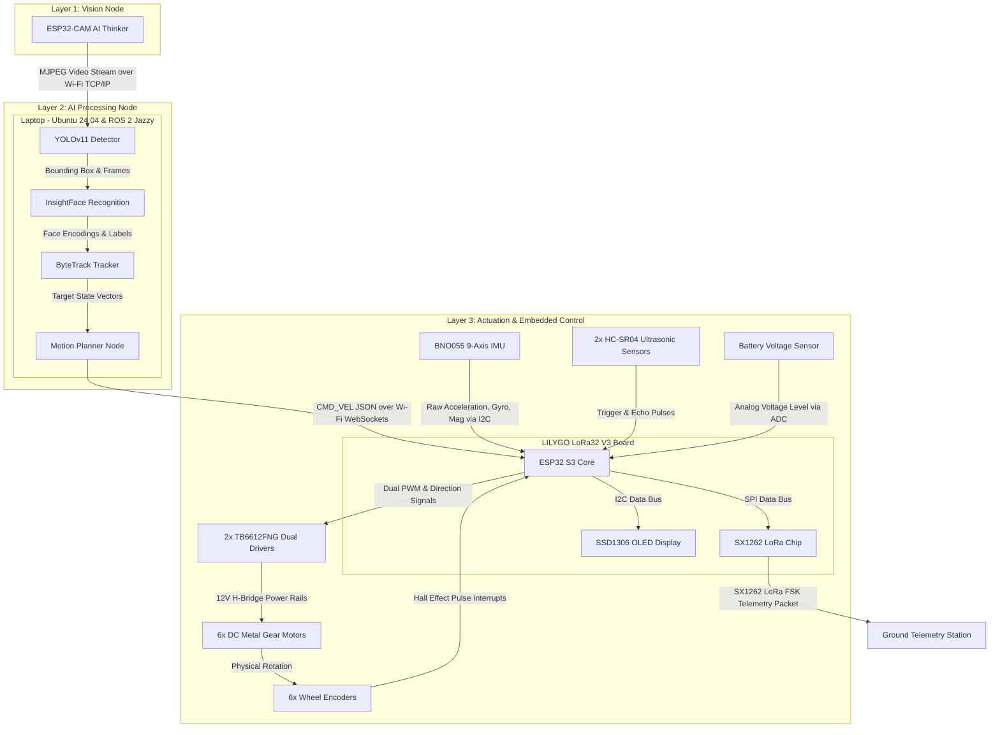
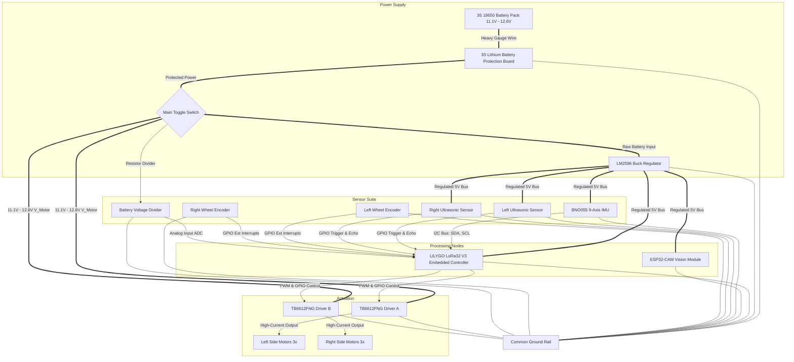

# 02. System & Hardware Architecture

This document presents the high-level physical and logical organization of the Autonomous Human-Following Robot, detailing communication protocols and physical electrical interconnections.

---

## 1. Logical System Architecture

The robot comprises three computing layers interacting over standard communication protocols:
1. **Perception (Vision Node)**: Runs on the ESP32-CAM to capture and transmit high-definition MJPEG video streams.
2. **AI Reasoning (ROS 2 Host)**: Computes vision models, speaker intent, EKF localization, and publishes velocity vectors.
3. **Execution & Telemetry (Embedded Controller)**: Decodes movement vectors, regulates wheel speeds, reads sensors, and sends long-range diagnostics.

---

## 2. Hardware Architecture Interconnections

The block diagram below describes physical hardware connections, power distribution pathways, control channels, and communication interfaces.

---

## 3. Communication Channel Interface Specs

* **Vision Node $\rightarrow$ AI Laptop (Wi-Fi 802.11 b/g/n)**: Establishes an HTTP server on the ESP32-CAM. The laptop initiates a persistent TCP client connection to fetch an MJPEG stream at `http://<esp32_ip>:81/stream`.
* **AI Laptop $\rightarrow$ Embedded Controller (Wi-Fi WebSockets)**: The LILYGO runs a WebSocket Server. The ROS 2 Laptop connects as a client and streams JSON packets containing `x_vel`, `yaw_vel`, and `mode` at a rate of 20Hz.
* **Embedded Controller $\rightarrow$ Actuators (TB6612FNG - Hardware PWM)**: Drives two motor channels using differential phase configurations and PWM speed triggers.
* **Sensors $\rightarrow$ Embedded Controller**:
  * **BNO055 IMU**: Fast-mode I2C ($400\text{ kHz}$) using hardware registers.
  * **Ultrasonic HC-SR04**: Digital pulse capture.
  * **Encoders**: Dual-channel quadrature interrupt pins to measure directional wheel rotation.
  * **OLED**: SSD1306 driven over shared I2C bus ($400\text{ kHz}$).
  * **LoRa**: Transmits RF telemetry packets using the SX1262 LoRa transceiver over SPI at $433\text{ MHz}$ / $868\text{ MHz}$.
