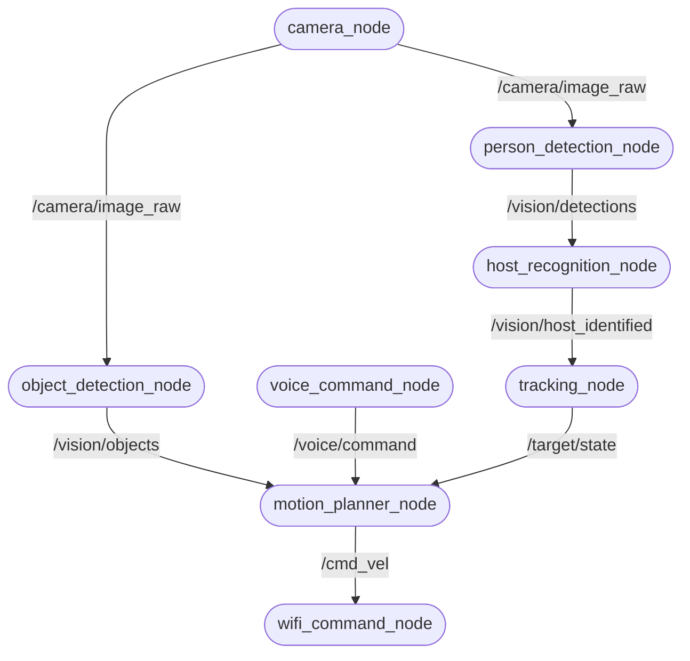

# 03. Software Architecture & ROS 2 Graph

This document details the software processing blocks, the ROS 2 node architecture, topics, message types, and the logical communication flow within the Ubuntu 24.04 and ROS 2 Jazzy ecosystem.

---

## 1. ROS 2 Software Node Architecture

The robot's reasoning engine is designed as a modular ROS 2 graph of independent nodes, utilizing publishers, subscribers, services, and action nodes to coordinate perception and locomotion.

### Onboard Embedded Nodes (Logical Representational Nodes)
To model the sensors and actuators on the LILYGO controller within the ROS 2 workspace, logical interface nodes are defined:
* **`motor_controller_node`**: Subscribes to `/cmd_vel` to translate linear and angular velocities into physical DC motor PWM commands.
* **`encoder_node`**: Publishes quadrature encoder pulse cycles as velocity updates `/sensor/wheel_ticks`.
* **`imu_node`**: Publishes angular velocity and acceleration from the BNO055 as `/sensor/imu_data`.
* **`ultrasonic_node`**: Publishes distance measurements as `/sensor/range`.
* **`oled_node`**: Subscribes to status and battery metrics to refresh the OLED.
* **`telemetry_node`**: Formats all sensor metrics and transmits over LoRa.

---

## 2. ROS 2 Topic Specifications

The following table catalogs the key ROS 2 topics driving the system:

| Topic | Publisher Node | Subscriber Node | Message Type | Purpose |
| :--- | :--- | :--- | :--- | :--- |
| `/camera/image_raw` | `camera_node` | `person_detection_node`, `object_detection_node` | `sensor_msgs/msg/Image` | Uncompressed MJPEG video frame feed from ESP32-CAM |
| `/vision/detections` | `person_detection_node` | `host_recognition_node` | `vision_msgs/msg/Detection2DArray` | Bounding boxes of detected humans in the frame |
| `/vision/host_identified` | `host_recognition_node` | `tracking_node` | `vision_msgs/msg/Detection2D` | Target bounding box indicating verified host's position |
| `/vision/objects` | `object_detection_node` | `motion_planner_node` | `vision_msgs/msg/Detection2DArray` | Non-human objects (obstacles, signs) detected |
| `/target/state` | `tracking_node` | `motion_planner_node` | `geometry_msgs/msg/Pose2D` | Target's relative coordinates (x, y) and heading angle |
| `/voice/command` | `voice_command_node` | `motion_planner_node` | `std_msgs/msg/String` | Spoken keywords parsed by local Whisper engine |
| `/cmd_vel` | `motion_planner_node` | `wifi_command_node` | `geometry_msgs/msg/Twist` | Velocity vectors: linear ($x$) and angular ($z$) speeds |
| `/sensor/wheel_ticks` | `encoder_node` | `motion_planner_node` | `std_msgs/msg/Int32MultiArray` | Raw left and right encoder wheel ticks |
| `/sensor/imu_data` | `imu_node` | `motion_planner_node` | `sensor_msgs/msg/Imu` | 9-DOF orientation, angular velocities, and accelerations |
| `/sensor/range` | `ultrasonic_node` | `motion_planner_node` | `sensor_msgs/msg/Range` | Left and right distance limits to prevent collisions |
| `/robot/status` | `motion_planner_node` | `oled_node`, `telemetry_node` | `std_msgs/msg/String` | System diagnostic metrics (Battery, Track State, Mode) |

---

## 3. ROS 2 Services & Actions

### Services
* **`/set_host_face` (`std_srvs/srv/Trigger`)**: Initiates a calibration routine that captures a snapshot of the human in front of the robot, extracts the face embedding, and saves it as the target host model.
* **`/toggle_following` (`std_srvs/srv/SetBool`)**: Dynamically enables or disables robot chassis motion while preserving the vision tracking stream.

### Actions
* **`/navigate_to_pose` (`nav2_msgs/action/NavigateToPose`)**: Action client interface that sends long-term target poses (e.g. "Move to room B") to the local motion planner. It provides continuous feedback on remaining distance and allows preemption if the host overrides the path.
