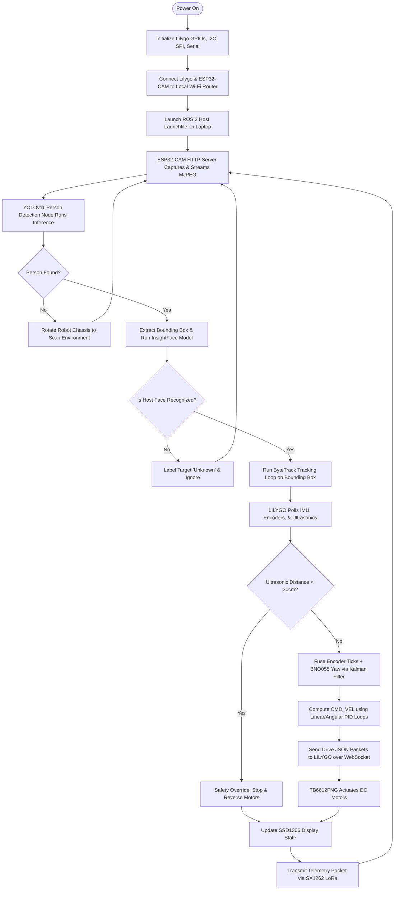
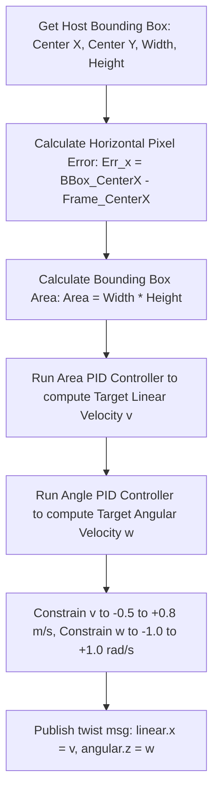
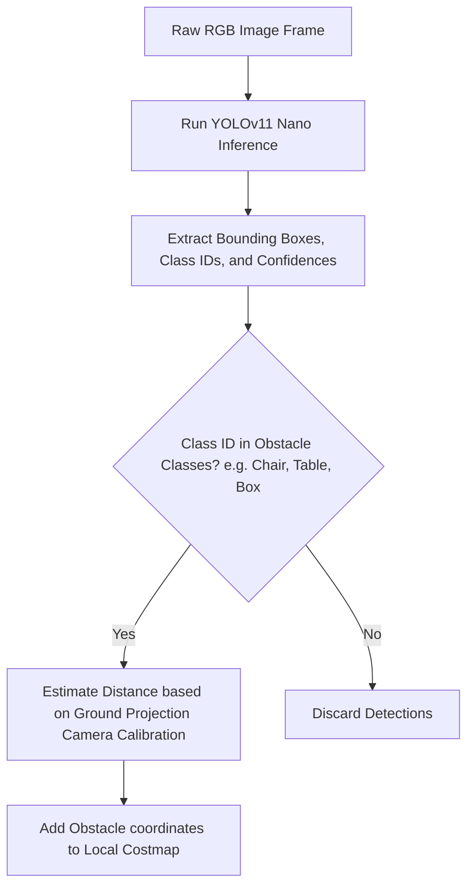
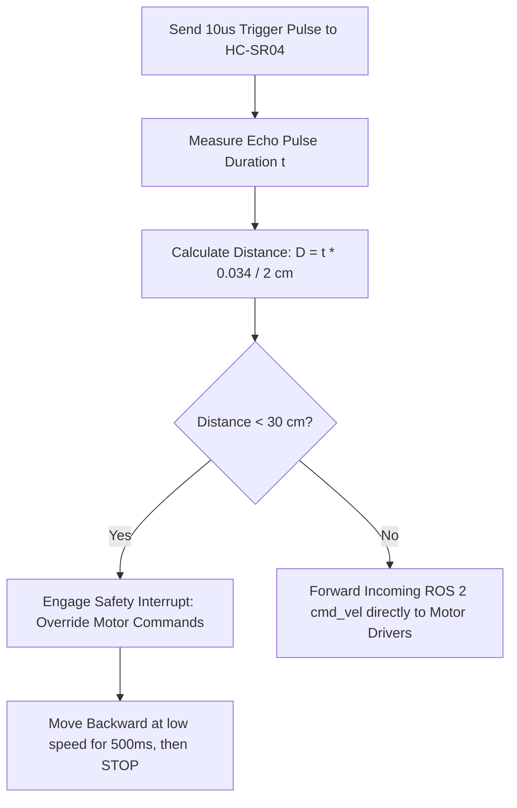
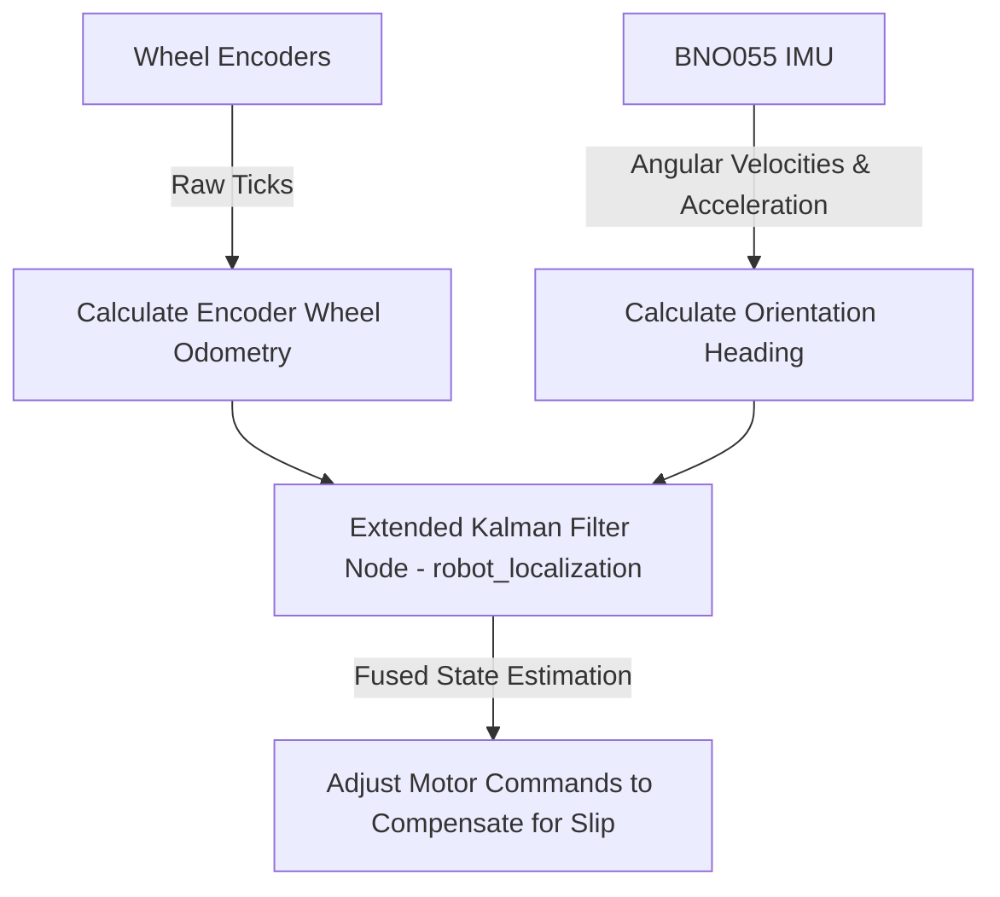

# 04. System Workflows & Control Algorithms

This document describes the operational workflows, algorithms, mathematical equations, and decision state machines that run the Autonomous Human-Following Robot.

---

## 1. Global System Workflow

This flowchart outlines the execution path from cold boot to the continuous tracking and telemetry loop.



---

## 2. Human-Following Algorithm

The following control loop ensures the robot maintains a safe distance and orientation relative to the host.



### Mathematical Formulations

1. **Angular Error Tracking (Yaw)**:
   $$e_{\theta}(t) = x_{\text{bbox\_center}} - x_{\text{frame\_center}}$$
   $$\omega(t) = K_{p,\theta} \, e_{\theta}(t) + K_{i,\theta} \int e_{\theta}(t) \, dt + K_{d,\theta} \frac{de_{\theta}(t)}{dt}$$

2. **Distance Error Tracking (Linear Vel)**:
   $$e_{d}(t) = A_{\text{target\_area}} - A_{\text{current\_area}}$$
   $$v(t) = K_{p,d} \, e_{d}(t) + K_{i,d} \int e_{d}(t) \, dt + K_{d,d} \frac{de_{d}(t)}{dt}$$

---

## 3. Face Recognition Workflow (InsightFace)

The host identification process uses a deep convolutional feature extractor to extract a highly discriminating vector representation of the face.

```mermaid
flowchart TD
    ImgIn[Read Face Sub-Image from BBox] --> Align[Perform Face Alignment using 5-point landmarks]
    Align --> FeedBackbone[Pass Image to ResNet-50 InsightFace Backbone]
    FeedBackbone --> Embedding[Generate 512-Dimensional Feature Vector V_curr]
    
    Embedding --> DBCompare[Retrieve Registered Host Embedding V_host from local DB]
    DBCompare --> SimCalc[Calculate Cosine Similarity: S = V_curr . V_host / ||V_curr|| * ||V_host||]
    
    SimCalc --> SimCheck{Similarity S > 0.65?}
    SimCheck -- Yes --> Auth[Host Authenticated: Lock-On & Track]
    SimCheck -- No --> AuthFail[Reject: Tag Person as Unknown]
```

---

## 4. Object Detection Workflow (YOLOv11)

To detect obstacles and classify surrounding objects, the raw image frame is sent to a YOLOv11 pipeline.



---

## 5. Obstacle Avoidance Workflow

A physical safety loop runs on the LILYGO controller, polling the HC-SR04 ultrasonic sensors at 50Hz to override any commands received from the laptop in case of immediate collision.



---

## 6. Sensor Fusion Navigation Workflow

To prevent wheel slippage errors on the 6-wheel metal chassis, encoder data is fused with inertial sensors.



### EKF State Model
The EKF estimates the robot's pose vector:
$$X = \begin{bmatrix} x & y & \theta & v_x & v_y & \omega \end{bmatrix}^T$$

* **Prediction Step**: Utilizes kinematic model driven by wheel encoder velocities.
* **Correction Step**: Minimizes error in $\theta$ and $\omega$ using high-accuracy IMU magnetometer and gyroscope output, keeping spatial tracking accurate.
