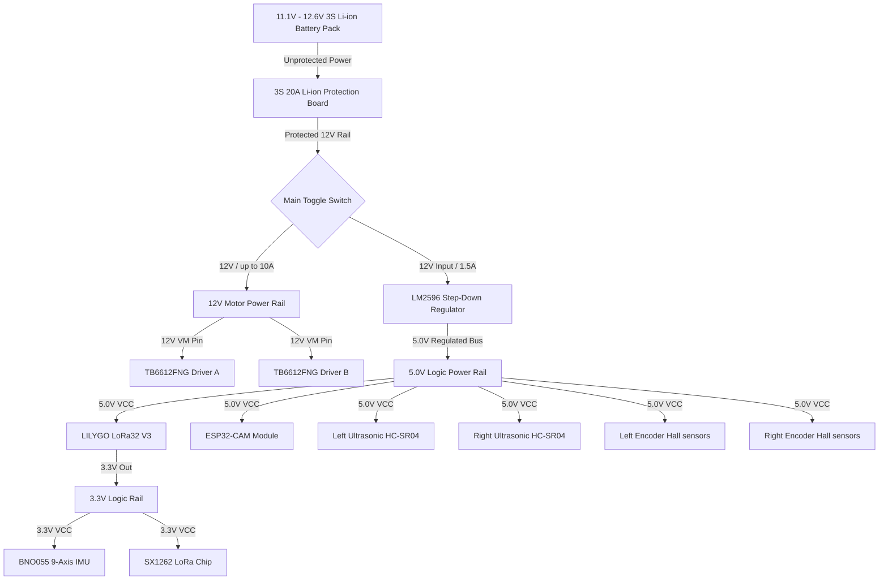

# 05. Electrical Schematic & Wiring Architecture

This document contains the detailed wiring schematics, power distribution trees, and pin mapping tables for the physical connections of the Autonomous Human-Following Robot.

---

## 1. Physical Wiring Schematic & Pin Routing

The schematic represents the electrical connections of all subsystems. Due to the high current requirements of the six DC metal gear motors, the motor power rail (VM) is isolated from the logic power rails (5V and 3.3V) through H-bridge isolation.

```text
========================================================================================================
                                     LILYGO LORA32 V3 PIN CONNECTIONS
========================================================================================================

                             +-----------------------------+
                             |       LILYGO LoRa32 V3      |
                             |                             |
     [TB6612 ENA] <======= 1 | GPIO1/PWM_A       SDA/18/I2C| ======> [BNO055 SDA / OLED SDA]
     [TB6612 IN1] <======= 2 | GPIO2             SCL/17/I2C| ======> [BNO055 SCL / OLED SCL]
     [TB6612 IN2] <======= 3 | GPIO3                   GND | ------- [Common Ground Rail]
  [Battery Divider] ======> 4 | GPIO4/ADC_1             3V3 | =======> [BNO055 VCC (3.3V)]
     [TB6612 ENB] <======= 6 | GPIO6/PWM_B             USB | <====== [5V Buck Output]
     [TB6612 IN3] <======= 7 | GPIO7                   5V  | =======> [Ultrasonic & Encoder VCC]
                             |                             |
    [US_Left Trig] <===== 12 | GPIO12                 SPI  | ------- [LoRa Interface (Internal)]
    [US_Left Echo] =====> 47 | GPIO47                 SCK  | ------> Pin 9
   [US_Right Trig] <===== 15 | GPIO15                 MOSI | ------> Pin 10
   [US_Right Echo] =====> 16 | GPIO16                 MISO | ------> Pin 11
                             |                        NSS  | ------> Pin 8
     [Encoder L-A] =====> 41 | GPIO41 (INT)           RST  | ------> Pin 5
     [Encoder L-B] =====> 42 | GPIO42                 BUSY | ------> Pin 13
     [Encoder R-A] =====> 39 | GPIO39 (INT)           DIO1 | ------> Pin 14
     [Encoder R-B] =====> 40 | GPIO40                      |
                             |       RGB Status LED        |
    [Active Buzzer] <==== 46 | GPIO46            R/G/B/38  | ======> [RGB Red Pin]
                             +-----------------------------+

========================================================================================================
                                     ESP32-CAM (VISION MODULE) CONNECTIONS
========================================================================================================

                             +-----------------------------+
                             |          ESP32-CAM          |
                             |                             |
      [5V Buck Out] =======> | 5V                      GND | ------- [Common Ground Rail]
                             | VCC (3.3)            U0_TXD | ------> [FTDI RX (Programming only)]
                             |                      U0_RXD | <------ [FTDI TX (Programming only)]
                             +-----------------------------+

========================================================================================================
                                     POWER & MOTOR DRIVE CONFIGURATIONS
========================================================================================================

    3S Li-ion (11.1V-12.6V) ===> [BMS] ===> [Switch] ===+===> [LM2596 Buck] ===> 5V Logic Bus
                                                        |
                                                        +===> [TB6612 VM Pin]  ===> 12V Motor Rail
```

---

## 2. Colored Wiring Diagram Reference

To ensure safe routing and prevent short circuits during hand-wiring, follow this standard color-coding configuration:

* <span style="color:red">**Red Wire**</span>: High-Current Motor Power ($11.1\text{V} - 12.6\text{V}$) and Logic Power ($5\text{V}$ & $3.3\text{V}$).
* <span style="color:black">**Black Wire**</span>: Common System Ground (GND). All ground terminals must tie into this rail.
* <span style="color:blue">**Blue Wire**</span>: I2C Data lines (SDA) and SPI Data lines (MOSI).
* <span style="color:green">**Green Wire**</span>: I2C Clock lines (SCL) and SPI Clock lines (SCK).
* <span style="color:yellow">**Yellow Wire**</span>: Actuator Control Signals (PWM, TB6612 Input directions).
* <span style="color:orange">**Orange Wire**</span>: Encoder pulse channels (A and B).
* <span style="color:gray">**White Wire**</span>: General digital sensors (Ultrasonic Trigger and Echo pins).

---

## 3. Power Distribution Tree (Current Flow)

The power distribution system is regulated to isolate high-inductive spikes generated by the 6 DC metal gear motors from the sensitive logic components.



---

## 4. GPIO Assignment Table

| Pin Number | Device Name | Signal Identifier | Interface Protocol | Operating Voltage | Purpose / Note |
| :--- | :--- | :--- | :--- | :--- | :--- |
| **GPIO 1** | TB6612 Driver A | `PWM_A` | PWM | $3.3\text{ V}$ | Left motor group speed control |
| **GPIO 2** | TB6612 Driver A | `IN1` | GPIO Output | $3.3\text{ V}$ | Left motor forward control |
| **GPIO 3** | TB6612 Driver A | `IN2` | GPIO Output | $3.3\text{ V}$ | Left motor backward control |
| **GPIO 4** | Voltage Divider | `BAT_ADC` | ADC | $0 - 3.1\text{ V}$ | Monitors battery voltage levels |
| **GPIO 6** | TB6612 Driver B | `PWM_B` | PWM | $3.3\text{ V}$ | Right motor group speed control |
| **GPIO 7** | TB6612 Driver B | `IN3` | GPIO Output | $3.3\text{ V}$ | Right motor forward control |
| **GPIO 8** | SX1262 LoRa | `NSS` | SPI CS | $3.3\text{ V}$ | LoRa Chip Select line |
| **GPIO 9** | SX1262 LoRa | `SCK` | SPI SCK | $3.3\text{ V}$ | SPI Clock line |
| **GPIO 10**| SX1262 LoRa | `MOSI` | SPI MOSI | $3.3\text{ V}$ | SPI Master Out Slave In |
| **GPIO 11**| SX1262 LoRa | `MISO` | SPI MISO | $3.3\text{ V}$ | SPI Master In Slave Out |
| **GPIO 12**| HC-SR04 (Left)  | `TRIG_L` | GPIO Output | $3.3\text{ V}$ (Trigger) | Initiates ultrasonic pulse |
| **GPIO 47**| HC-SR04 (Left)  | `ECHO_L` | GPIO Input | $3.3\text{ V}$ (via divider) | Measures echo return width |
| **GPIO 15**| HC-SR04 (Right) | `TRIG_R` | GPIO Output | $3.3\text{ V}$ (Trigger) | Initiates ultrasonic pulse |
| **GPIO 16**| HC-SR04 (Right) | `ECHO_R` | GPIO Input | $3.3\text{ V}$ (via divider) | Measures echo return width |
| **GPIO 17**| BNO055 & OLED | `SCL` | I2C SCL | $3.3\text{ V}$ | Shared I2C Clock line |
| **GPIO 18**| BNO055 & OLED | `SDA` | I2C SDA | $3.3\text{ V}$ | Shared I2C Data line |
| **GPIO 39**| Left Encoder | `ENC_L_A` | External Interrupt| $3.3\text{ V}$ (via divider) | Ticks channel A |
| **GPIO 40**| Left Encoder | `ENC_L_B` | GPIO Input | $3.3\text{ V}$ (via divider) | Ticks channel B (direction) |
| **GPIO 41**| Right Encoder | `ENC_R_A` | External Interrupt| $3.3\text{ V}$ (via divider) | Ticks channel A |
| **GPIO 42**| Right Encoder | `ENC_R_B` | GPIO Input | $3.3\text{ V}$ (via divider) | Ticks channel B (direction) |
| **GPIO 46**| Active Buzzer | `BUZZER` | GPIO Output | $3.3\text{ V}$ | Sounds warnings on low-bat/obstacle |
