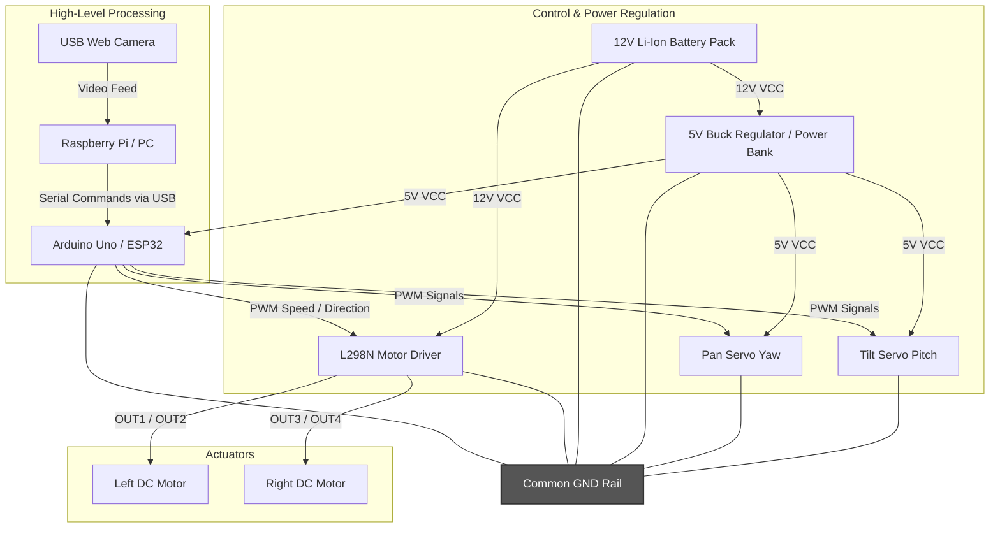
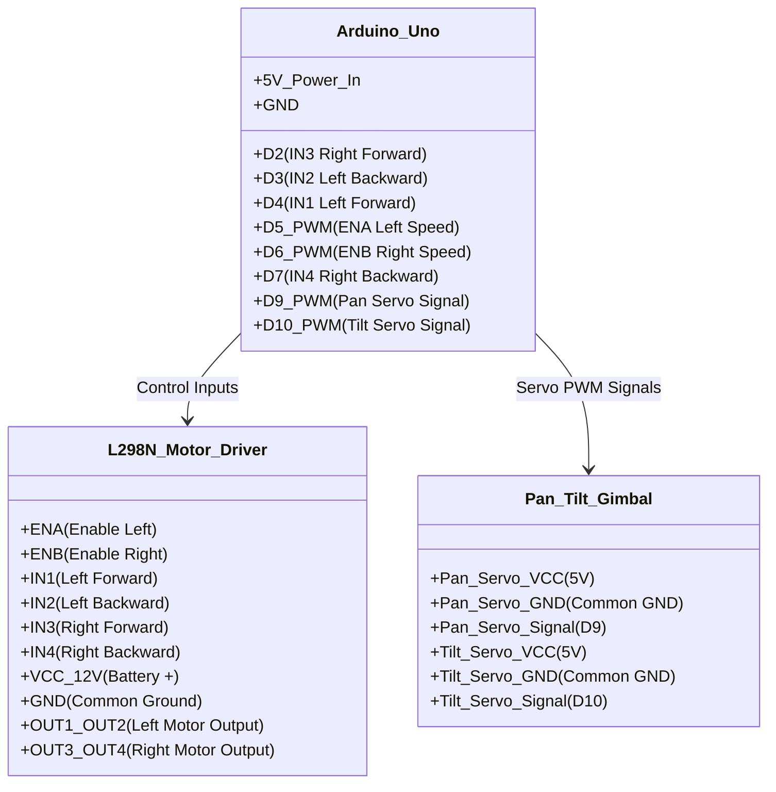

# Circuit Diagram & Hardware Architecture

This document describes the electrical wiring, power distribution, and signal connections for the Human-Following Robot.

---

## 1. System Architecture Block Diagram

The robot's electronics are divided into three primary layers:
1. **Perception and Command (High-Level)**: A Raspberry Pi / PC running Python, MediaPipe, and OpenCV.
2. **Control & Signal Routing (Low-Level)**: An Arduino Uno (or ESP32) reading Serial commands.
3. **Power and Actuation**: Dual DC motors powered via an L298N motor driver, and Pan-Tilt servos powered directly.

---

## 2. Pin Connection Table

To assemble the robot, connect the components as specified in the table below:

| Source Component | Source Pin / Label | Destination Component | Destination Pin / Label | Signal Type | Description |
| :--- | :--- | :--- | :--- | :--- | :--- |
| **Arduino Uno** | D5 (PWM) | **L298N Driver** | ENA | Output (PWM) | Left Motor Speed Control |
| **Arduino Uno** | D4 | **L298N Driver** | IN1 | Output (Digital) | Left Motor Forward Direction |
| **Arduino Uno** | D3 | **L298N Driver** | IN2 | Output (Digital) | Left Motor Backward Direction |
| **Arduino Uno** | D2 | **L298N Driver** | IN3 | Output (Digital) | Right Motor Forward Direction |
| **Arduino Uno** | D7 | **L298N Driver** | IN4 | Output (Digital) | Right Motor Backward Direction |
| **Arduino Uno** | D6 (PWM) | **L298N Driver** | ENB | Output (PWM) | Right Motor Speed Control |
| **Arduino Uno** | D9 (PWM) | **Pan Servo** | Signal (Yellow/Orange) | Output (PWM) | Camera Yaw Control |
| **Arduino Uno** | D10 (PWM) | **Tilt Servo** | Signal (Yellow/Orange) | Output (PWM) | Camera Pitch Control |
| **L298N Driver** | OUT1 / OUT2 | **Left DC Motor** | +/- Terminals | Output (Power) | Left Wheel Drive |
| **L298N Driver** | OUT3 / OUT4 | **Right DC Motor** | +/- Terminals | Output (Power) | Right Wheel Drive |
| **12V Battery** | Positive (+) | **L298N Driver** | 12V Screw Terminal | Power (Input) | Main Motor Power |
| **12V Battery** | Negative (-) | **GND Rail** | Common Ground | Ground | Return Path |
| **5V Buck Reg** | Positive (+) | **Arduino / Servos** | 5V / VCC Pins | Power (Output) | Regulated Logic & Servo Power |
| **5V Buck Reg** | Negative (-) | **GND Rail** | Common Ground | Ground | Return Path |

---

## 3. Detailed Wiring Schematic (Logical Flow)

> [!IMPORTANT]
> **Common Ground Requirement:**
> Always connect the `GND` of the L298N motor driver, the `GND` of the Arduino, the negative (-) terminal of the 12V battery, and the `GND` of the servo power source together. Without a shared common ground reference, the control signals will fluctuate, causing erratic motor behaviors or servo jitters.

> [!WARNING]
> **Servo Power Source:**
> Avoid powering the Pan/Tilt servo motors directly from the Arduino's 5V pin. Servos draw high peak currents (up to 1A during movement) which can trigger the Arduino's thermal overload protection or cause it to reset. Use an external 5V UBEC/Buck regulator or a secondary power bank.
