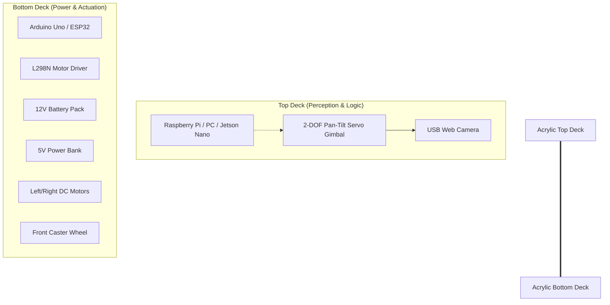

# Mechanical Robot Design & Chassis Layout

This document describes the physical structure, chassis configuration, component mounting stack, and mechanical specifications of the Human-Following Robot.

---

## 1. Chassis Configuration

The robot is built on a **differential drive** platform which provides high agility, zero-radius turning, and simplicity.

* **Drive System**: Two active DC Gear Motors with rubber wheels mounted on the left and right sides.
* **Balance System**: One omnidirectional caster wheel at the front or rear to prevent tipping while allowing frictionless rotation.
* **Material**: 3mm Acrylic or 3D-Printed PLA plate (double-deck layout).

---

## 2. Component Placement Stack (Physical Layering)

To optimize the center of gravity (CoG) and prevent the robot from tipping during sudden acceleration or deceleration, the components are stacked vertically in two decks.



### Deck Layout Breakdown

1. **Bottom Deck (Heavy Components)**
   * **DC Motors**: Mounted underneath the bottom plate.
   * **Caster Wheel**: Mounted underneath the plate at the front.
   * **12V Motor Battery Pack**: Secured in the center of the bottom deck for a low center of gravity.
   * **L298N Motor Driver**: Placed near the motor leads to keep power wiring short.
   * **Arduino Uno**: Mounted alongside the motor driver for easy signal routing.

2. **Top Deck (Sensors & High-Level Compute)**
   * **5V Power Bank / Regulator**: Placed at the back of the deck to balance the forward weight of the camera.
   * **Raspberry Pi / Single-Board Computer**: Mounted centrally on the top deck.
   * **Pan-Tilt Gimbal**: Mounted at the absolute front of the top deck to give the camera an unobstructed 180° field of view (FOV).

---

## 3. Pan-Tilt Gimbal (2-DOF Track Mechanism)

The camera is mounted on a 2-Axis (Pan-Tilt) Servo Mechanism. This allows the robot to track a human's face smoothly without continuously engaging the high-torque chassis motors.

```text
       [ USB Camera ]
             │
      ┌──────┴──────┐
      │ Tilt Servo  │ (Pitch - Vertical Rotation: up/down)
      └──────┬──────┘
             │
      ┌──────┴──────┐
      │  Pan Servo  │ (Yaw - Horizontal Rotation: left/right)
      └──────┬──────┘
             │
     [ Robot Chassis ]
```

* **Pan Axis (Yaw)**: Uses a standard SG90 or MG90S servo. Rotates left/right within a **120° range** (from 30° to 150°, centered at 90°).
* **Tilt Axis (Pitch)**: Uses a standard SG90 or MG90S servo. Rotates up/down within a **90° range** (from 45° to 135°, centered at 90°).

---

## 4. Mechanical Specifications

| Parameter | Specification | Purpose / Notes |
| :--- | :--- | :--- |
| **Total Weight** | ~1.2 kg | Lightweight for rapid responsiveness |
| **Dimensions** | 220mm x 150mm x 250mm | Compact desktop/floor mobile robot |
| **Wheel Diameter**| 65mm | Provides speed and obstacle clearance |
| **Ground Clearance**| 15mm | Ideal for flat indoor surfaces |
| **Max Payload** | 800g | Able to support SBCs, batteries, and sensors |
| **Tracking Range** | 0.5m to 3.0m | Mediapipe face detection optimal range |

---

## 5. System Balancing Tips

> [!TIP]
> **Avoid Front-Tipping:**
> Ensure that the caster wheel is securely aligned. If the camera gimbal makes the robot front-heavy, shift the 12V battery pack slightly toward the rear axles to offset the load.

> [!IMPORTANT]
> **Vibration Isolation:**
> The camera feed is sensitive to chassis vibrations caused by DC motor gears. Mount the camera gimbal using small rubber grommets or double-sided foam tape to absorb high-frequency motor vibrations and avoid Kalman filter tracking jitter.
