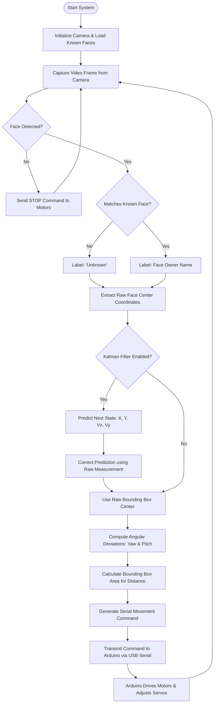
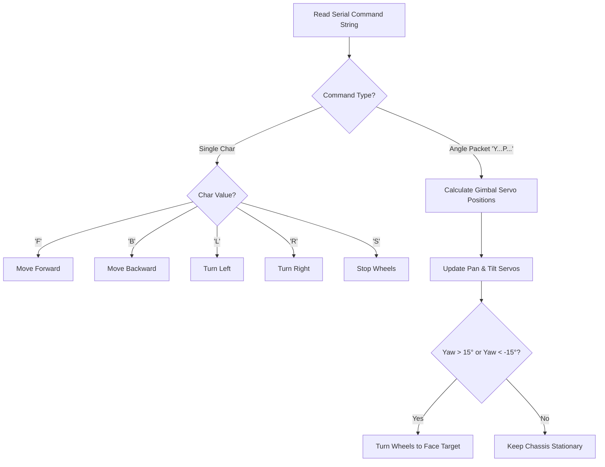

# Workflow & Tracking Flowchart

This document details the software processing pipeline, tracking control loops, Kalman filter mathematics, and decision logic that drives the Human-Following Robot.

---

## 1. High-Level Software Workflow

The robot operates on a closed-loop control system running at ~30 FPS:

---

## 2. Tracking Control Loop Details

### A. Angle & Position Offset Calculations

The system calculates horizontal (`yaw`) and vertical (`pitch`) deviations from the center of the camera frame. These values are used to direct the servo pan-tilt mount.

* **Pixel Deviation**:
  $$\Delta x = x_{\text{face}} - x_{\text{center}}$$
  $$\Delta y = y_{\text{face}} - y_{\text{center}}$$

* **Angular Conversion**:
  $$\text{Yaw Angle} = \Delta x \times \left( \frac{\text{Horizontal FOV}}{\text{Frame Width}} \right)$$
  $$\text{Pitch Angle} = \Delta y \times \left( \frac{\text{Vertical FOV}}{\text{Frame Height}} \right)$$

### B. Distance Estimation (Bounding Box Area)

The distance to the human is estimated by calculating the area ($A$) of the face's bounding box:
$$A = \text{Width} \times \text{Height}$$

* **Target Area Range**: The robot is programmed with a target area range (e.g., $A_{\text{target}} \pm \text{threshold}$).
* **Behavior Matrix**:
  * **$A > A_{\text{target}} + \text{threshold}$**: Face is too close $\rightarrow$ **Move Backward**.
  * **$A < A_{\text{target}} - \text{threshold}$**: Face is too far $\rightarrow$ **Move Forward**.
  * **Otherwise**: Face is in target range $\rightarrow$ **Stop Motors (Maintain distance)**.

### C. Kalman Filter Smoothing

The Kalman Filter models the face movement using a constant velocity kinematic model. The state vector is:
$$X = \begin{bmatrix} x & y & v_x & v_y \end{bmatrix}^T$$

Where:
* $x, y$ are the center coordinates of the face.
* $v_x, v_y$ are the velocities along the x and y axes.

By predicting the state in the next frame and updating it with the actual face detection bounding box, the Kalman filter eliminates sudden detection drops or noise, preventing erratic servo jitters.

---

## 3. Arduino Command Dispatch Logic

The Arduino processes the incoming commands to actuate the robot. Here is the decision flow executed on the microcontroller:

---

## 4. Performance Optimization Tips

> [!TIP]
> **Reducing Latency:**
> MediaPipe face detection is faster than standard HOG face detection. In `fast_face_recognition.py`, the image frame is scaled down to `0.25x` before encoding to speed up face recognition matching. This is critical for real-time control, as any processing lag greater than 100ms will cause the robot to overshoot its targets.

> [!IMPORTANT]
> **Occlusion Handling:**
> When a face is temporarily blocked (occluded), the detection returns `None`. When this happens, the Kalman filter's prediction step can estimate where the face is going to be for a few frames, preventing the robot from stopping immediately.
